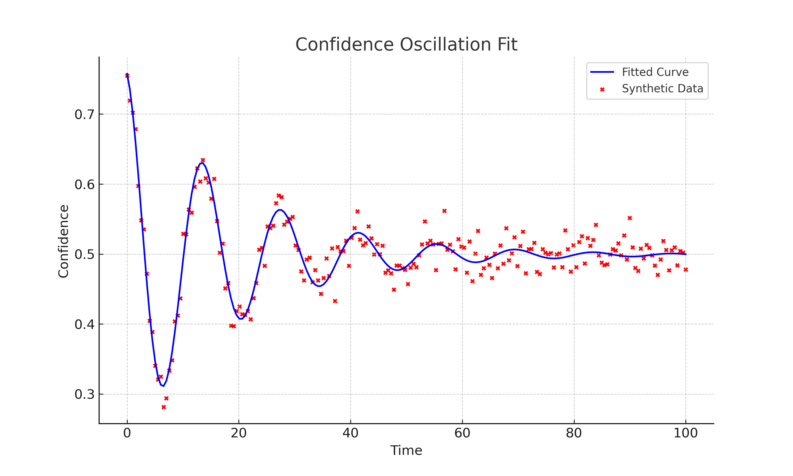

# Confidence Oscillation

Visualize the damped χ-wave fit to solver confidence history. The chart below demonstrates the τ effect, where τ represents the decay constant of the oscillation, indicating how quickly the confidence stabilizes over time.

Parameters:
- Amplitude: Initial confidence level.
- Decay rate (τ): Rate at which confidence stabilizes.
- Period: Time between oscillation peaks.

The τ parameter controls how exploratory the confidence policy becomes. Higher τ spreads probability mass and encourages more exploratory selections.

The τ effect is critical for understanding solver calibration and risk tolerance adjustments in dynamic environments.
