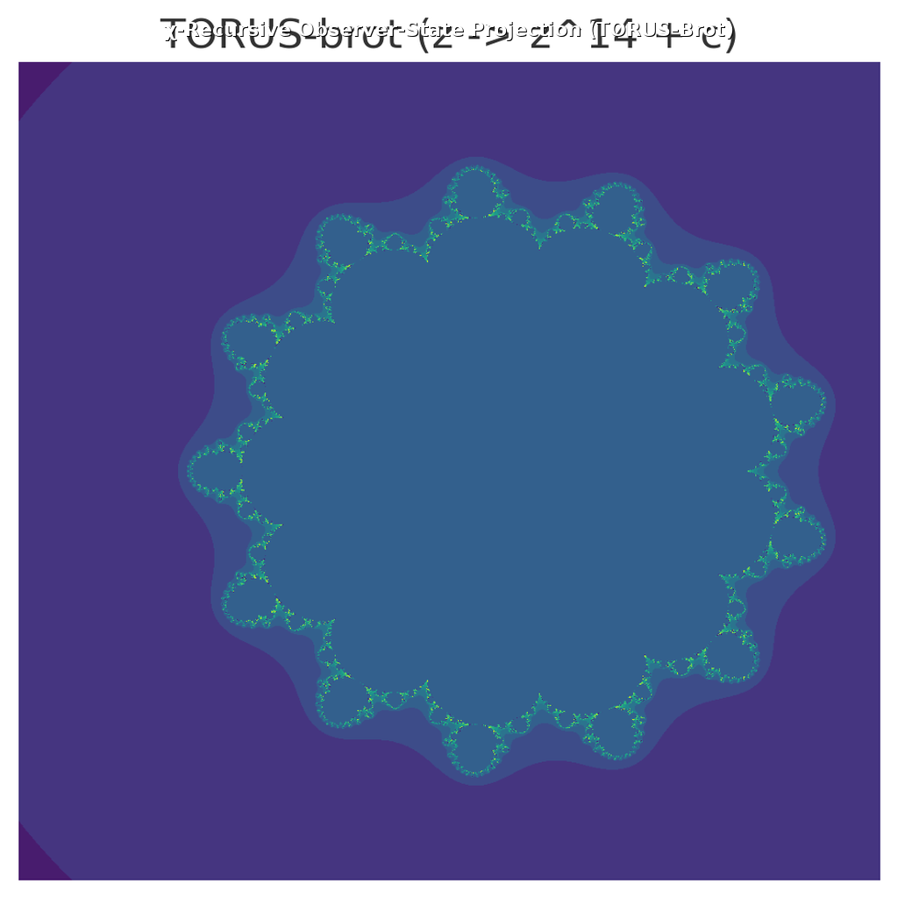

# Minesweeper Discovery Framework (MDF)

The Minesweeper Discovery Framework transforms complex domains into Minesweeper‑style puzzles to uncover hidden patterns and anomalies. Leveraging χ‑cycle and controller‑dimension theories, MDF enables hypothesis discovery across fields ranging from nuclear physics to prime number distributions. It is not a game; MDF provides deterministic AI reasoning, optional LLM integration, domain‑specific demos (e.g., Prime Spiral and χ‑brot), accessibility modes, and export functions.

## Key features

- Optional, provider‑agnostic LLM integration (disabled by default; deterministic when enabled)
- Domain‑specific demos (Prime Spiral, χ‑brot, and more)
- High‑contrast and colorblind modes for accessibility
- Export results (board state as JSON, move history as CSV)

## Installation

Choose one of the following:

- PyPI: `pip install ai-minesweeper-discovery-framework`
- From source:
	- Clone the repository
	- `pip install -e .`

## Usage

Run the Streamlit app:

```bash
streamlit run streamlit_app.py
```

Command‑line interface (CLI):

```bash
python -m ai_minesweeper.cli play examples/boards/sample.csv
python -m ai_minesweeper.cli validate examples/boards/sample.csv
```

The CLI allows playing or validating a board from CSV.

## Hero Panel



**χ Value:** 50-digit χ = 1.41421356237309504880168872420969807856967187537694

[](https://streamlit.app/?domain=TORUS-brot)

## Versions

### Changelog

<details>
<summary>v0.4</summary>
- Added TORUS-brot fractal module.
- Enhanced Meta-Cell Confidence Module.
</details>

<details>
<summary>v0.3</summary>
- Initial release with Hypothesis Discovery AI.
</details>

## Tutorials

- [Discovering φ-Phase Reset](tutorials/discovering_phi_phase_reset.md)
- [Prime Residue Recursion](tutorials/prime_residue_recursion.md)
- [Periodic Table Demo](tutorials/element_discovery.md)
- [Fractal Demo](torus_brot_demo.md): Explore the χ-recursive observer-state projection and its implications in Hypothesis Discovery theory.

## White-paper

- [What is AI-Hypothesis Discovery?](whitepage.pdf)
